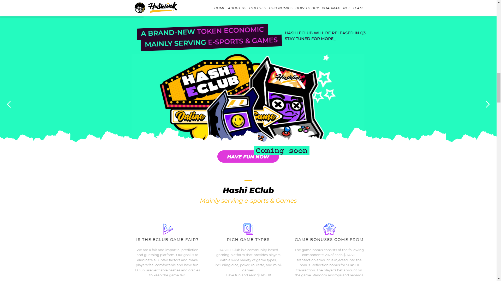
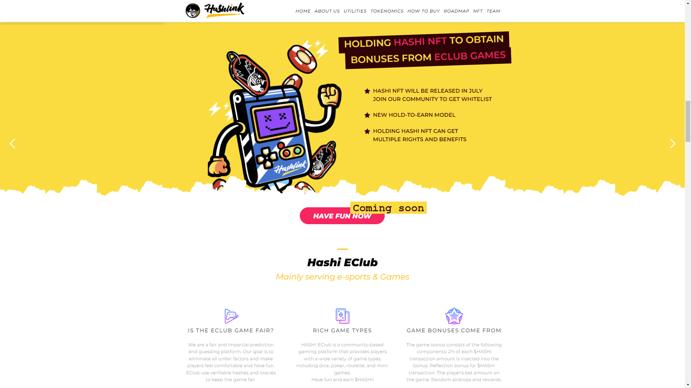
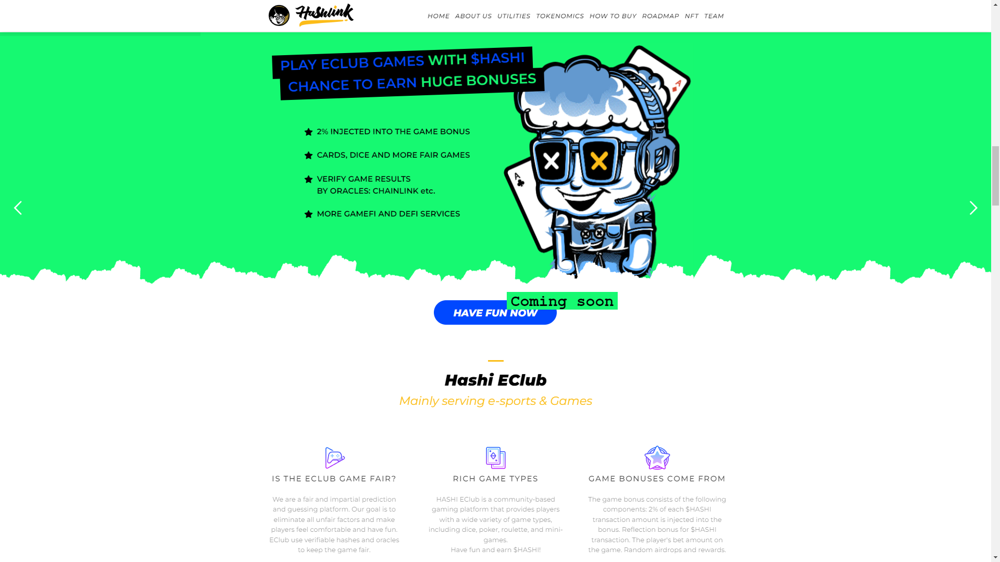

# HASHI E-CLUB

#### A BRAND NEW TOKEN ECONOMIC MAINLY SERVING E-SPORTS & GAMES

#### HOLDING HASHI NFT TO OBTAIN BONUSES FROM ECLUB GAMES

* Hashi NFT will be release in July, Join our community for ways to get whitelist for mint!
* New hold to earn model.
* Holding Hashi NFT can get multiple rights and benefits.

#### PLAY ECLUB GAMES WITH $HASHI TO GET CHANCE TO EARN HUGE BONUSES

* 2% of user purchase will be insert to game bonuses.
* Cards, Dice and more Fair Games.
* Verify Game Results: By Oracles: ChainLink etc.
* More Gamefi and Defi services

## HASHI ECLUB

#### <mark style="color:yellow;">Mainly serving Esport & Games</mark>

**IS THE ECLUB GAME FAIR?**

* We are a fair and impartial prediction and guessing platform. Our goal is to eliminate all unfair factors and make players feel comfortable and have fun.
* EClub use verifiable hases and oracles to keep the game fair.

**RICH GAME TYPES?**

* HASHI EClub is a community-based gaming platform that provides players witih a wide variety of game types including dice,poker,roulette,and mini-games.

**GAME BONUSES**

* **The game bonus consists of the following components:**\
  ****2% of each $HASHI Transaction amount is injected into the bonus. Reflection bonus for Hashi Transaction, The player's bet amount on the game and Random Airdrops and rewards.
